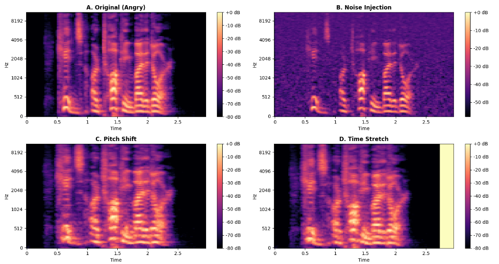
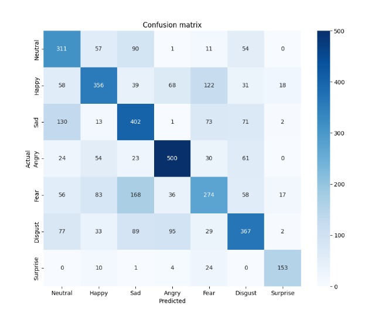

# Multimodal Emotion Recognition Project

**Status: Work in Progress**

This repository contains the implementation of a multimodal system for human emotion recognition. The project integrates audio and video data to improve classification accuracy compared to single-modality approaches.

## System Architecture

The project is built on a late-fusion strategy involving two specialized neural networks:
- **Audio Model**:  trained on vocal features extracted from speech signals;
- **Video Model**: focused on facial expression analysis and micro-expressions;
- **Fusion Layer**:  combines representations from both modalities to produce an emotion prediction;

### Datasets Used
- **RAVDESS**: The Ryerson Audio-Visual Database of Emotional Speech and Song;
- **CREMA-D**: Crowd-sourced Emotional Multimodal Actors Dataset;

## Project Structure
- `audio/`: Python scripts for audio preprocessing and audio model training;
- `video/`: (Coming soon) Scripts for frame extraction, face detection, and video model training;
- `fusion/`: (Coming soon) Integration logic and multimodal fusion layers;
- `requirements.txt`: List of dependencies and libraries required to run the project;
- `.gitignore`: Configuration file to exclude large datasets, video frames, and compiled model files;

## Experimental Results

### Audio Modality Performance
Below is the confusion matrix for the current audio-only emotion recognition model:


### Update: Data Augmentation & Performance Analysis

To enhance the model's generalization capabilities and address class imbalance, I implemented **offline audio data augmentation**. This process expanded the training set from approximately 10,000 samples to a total of **39,752 samples**.

#### 1. Audio Augmentation Techniques
For every original audio file, four distinct versions were generated to help the model learn invariant acoustic features:

| Technique | Description                                                                        |
| :--- |:-----------------------------------------------------------------------------------|
| **Original** | the baseline Mel-spectrogram of the audio signal;                                  |
| **Noise Injection** | added white noise to simulate varied recording environments;                       |
| **Pitch Shifting** | adjusted the pitch by ±2 semitones to decouple emotion from vocal range;           |
| **Time Stretching** | modified the playback speed by a factor of 1.1 to simulate different speech rates; |


*Figure 2: Visual comparison of the four augmentation states for an "Angry" emotion sample.*

#### 2. Evaluation Results
The model trained on the augmented dataset achieved a more balanced and reliable performance across all 7 emotional categories.

* **Final Test Accuracy:** **56.59%**
* **Key Finding:** The model showed a significant improvement in identifying the "Surprise" emotion and achieved high precision for "Angry" and "Sad" classes.


*Figure 2: Final Confusion Matrix showing improved distribution and reduced misclassifications.*


## Installation and Usage
1. Clone the repository to your local machine.
2. Install the required Python packages:
   ```bash
   pip install -r requirements.txt
   ```
   


